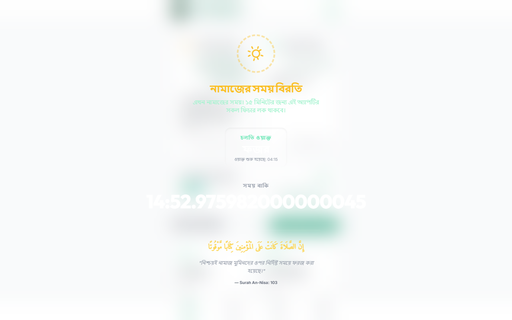
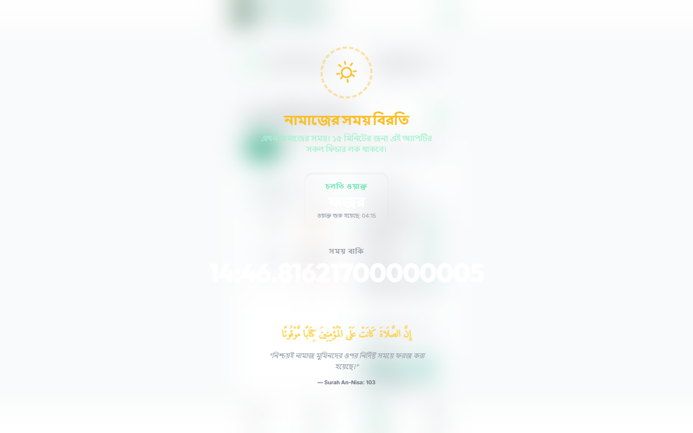
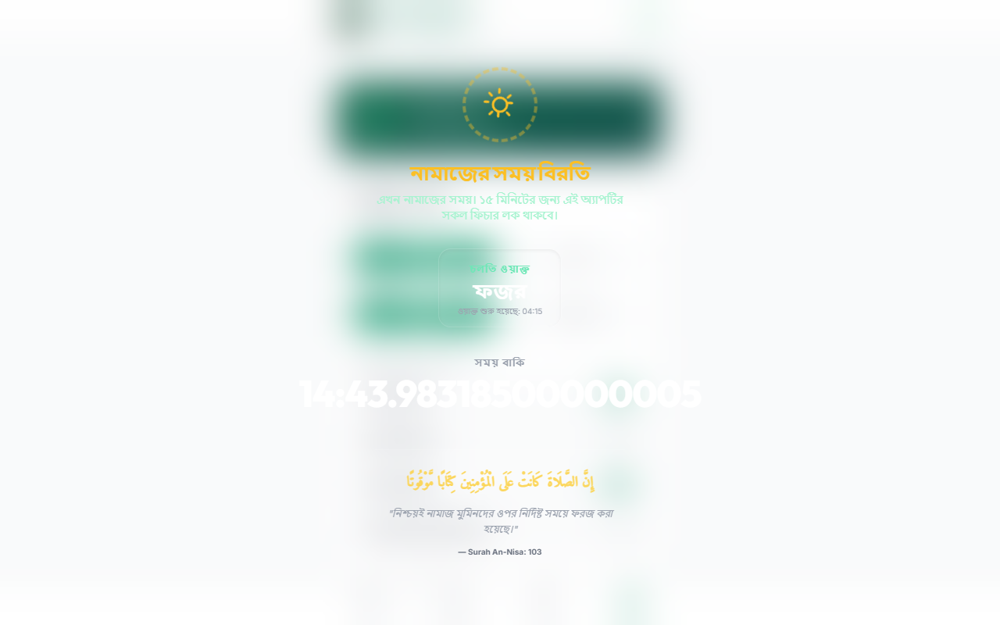
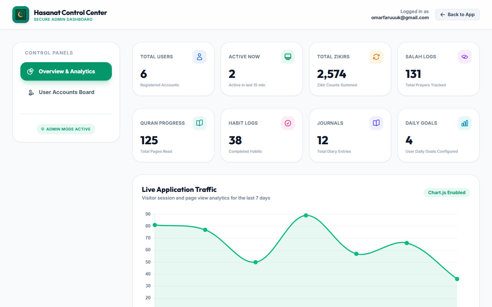

# Hasanat Tracker (Tazbih) - Spiritual Habit & Amal Tracker

Hasanat Tracker is a premium, feature-rich Islamic Habit Tracker and Tasbih Counter web application designed to help Muslims monitor and improve their daily worship, Quran recitations, habits, and reflections. Built using the modern TALL stack (Tailwind, Alpine.js, Laravel, Livewire), it offers a fast, fluid SPA experience with offline-first capabilities for guests and secure database storage for authenticated users.

---

## 📸 Screenshots

Here are previews of the Hasanat Tracker application:

| Login Page | Home Dashboard | Tasbih Counter |
|---|---|---|
|  |  |  |

| Records & Analytics | Settings Panel | Admin Control Center |
|---|---|---|
|  |  |  |

---

## 🛠️ Technology Stack

* **Backend Framework**: Laravel 11.x
* **Frontend Reactive Layer**: Livewire 3.x & Alpine.js
* **Styles**: Tailwind CSS (DarkMode: class)
* **Charts & Analytics**: Chart.js
* **Database**: MySQL / SQLite (Database driver-agnostic query design)
